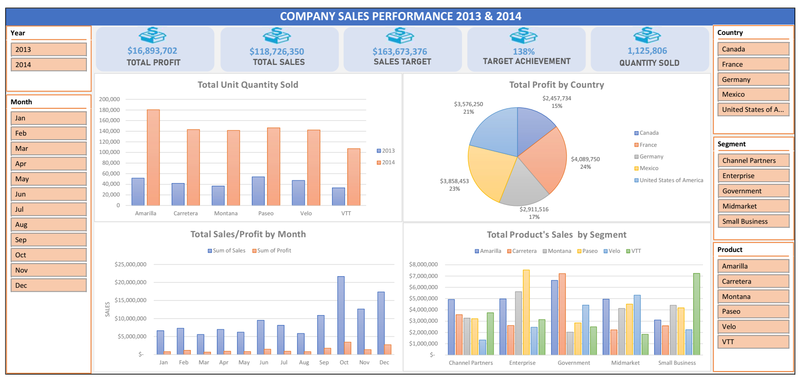

# Introduction
A company sold their product to different segments and countries. They have sales data in 2 years and want to analyze its performance to understand the market and grow further in the next years. 
# Task List
- Data Cleaning : Check and remove the duplicates, null & inconsistent data.
- Exploratory Data Analysis : Understand the dataset by using Power Pivot & Power Query to make data models for better processing, then using appropriate DAX functions & pivot tables to filter data and create charts.
- Dashboard : Create teamplate and arrange charts for better data visulization
- Insights : Provide useful insights to the stakeholders.

# Dashboard's page
