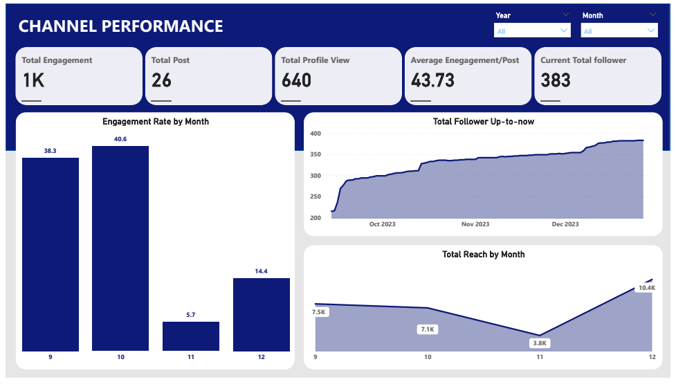
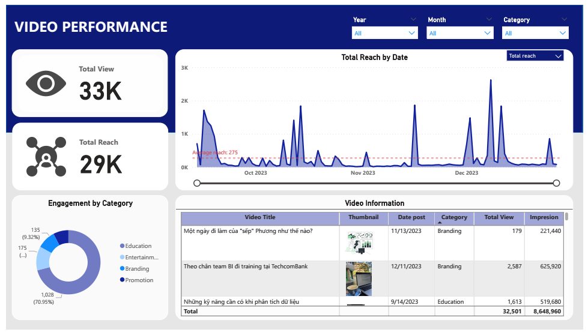
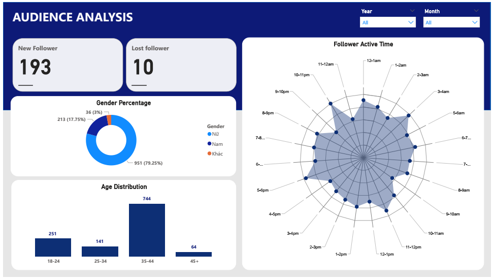

# Introduction
A company specializing in technical data training seeks to expand its customer base by leveraging Tiktok, one of the most popular social media platforms among the younger generation in the Vietnamese context. In order to better understand their current performance and cater to the needs of their customers, they examine the raw data provided by Tiktok. 

# Task List
- Data Cleaning & Transformation: null removal, data type converted.
- Combine multiple files from folder to create tables and process template using DAX function.
- Create data model using model view.
- Create measure using DAX function like SUM, CALCULATE, IF, DIVIDE to calculate necessary metrics. 
- Dashboard : Create teamplate and arrange different types of charts for better data visulization. 

# Dashboard's result: [LINK](https://app.powerbi.com/view?r=eyJrIjoiMzA4NDJmOTktOTA2Mi00MmE0LWJjNTAtZDRlZDQ4YTMxMmM3IiwidCI6IjQxYWI0MmE5LTM4MWItNDhjZi04YTg1LTcyMDQ2NDkyMjk3NiIsImMiOjEwfQ%3D%3D)
- Channel Performance

- Video Performance

- Audience Analysis
